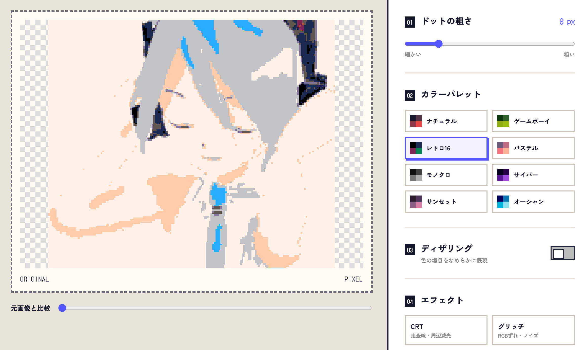

# ドット絵変換くん

画像をブラウザ上で簡単にドット絵風へ変換できるWebアプリです。

JPG・PNG・WebP画像を読み込み、ドットの粗さやカラーパレット、エフェクトを調整して、PNGまたはMP4形式で保存できます。

## 主な機能

- ドラッグ＆ドロップによる画像読み込み
- ドットの粗さ調整
- 8種類のカラーパレット
- ディザリング
- CRTエフェクト
- 動くグリッチエフェクト
- 元画像との比較表示
- PNG画像の保存
- 4秒間のMP4動画出力
- スマートフォン対応

## 使い方

1. 「画像を選ぶ」を押すか、画像を画面へドラッグ＆ドロップします。
2. ドットの粗さ、カラーパレット、ディザリング、エフェクトを調整します。
3. 「PNGで保存」または「4秒のMP4を保存」を押します。

## 対応画像

- JPG
- PNG
- WebP
- 最大15MB

## プライバシー

画像の変換処理は、すべて利用者のブラウザ内で行われます。選択した画像が外部サーバーへ送信されることはありません。

## MP4出力について

MP4出力はブラウザの録画機能を利用しています。ブラウザがMP4形式の録画に対応していない場合は、最新版のSafariでお試しください。

## 使用技術

- HTML
- CSS
- JavaScript
- Canvas API
- MediaRecorder API

## 作者

- [Akira Mukai](https://s0323861.github.io/)
- [GitHubリポジトリ](https://github.com/s0323861/pixel-art-converter)
